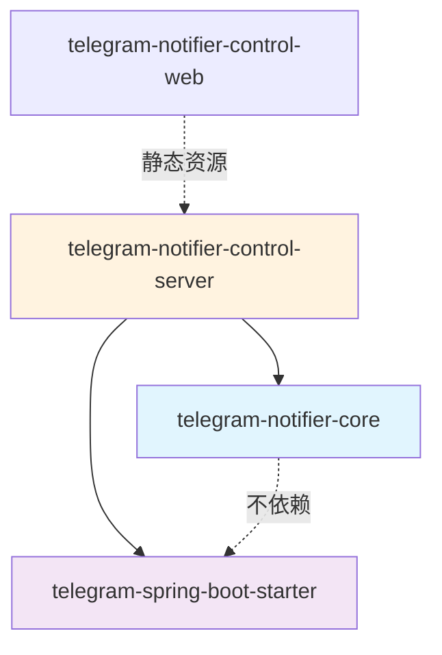

# Design: DAO Layer Extraction

## 模块依赖关系



## Core 模块包结构

```
site.kael.telegram.notifier.core/
├── dao/
│   ├── AdminDao.java
│   ├── TelegramAccountDao.java
│   ├── ProxyDao.java
│   ├── PushChannelDao.java
│   ├── NotificationRuleDao.java
│   ├── NotifiedMessageDao.java
│   └── StatisticsDao.java
├── model/
│   ├── TelegramAccount.java
│   ├── ProxyServer.java
│   ├── PushChannel.java
│   ├── NotificationRule.java
│   ├── DeliveryResult.java
│   └── StatisticsResponse.java
└── support/
    ├── JsonSupport.java
    └── ValidationSupport.java
```

## DAO 接口设计

### AdminDao

```java
@Repository
public class AdminDao {
    private final JdbcTemplate jdbc;
    
    // 检查是否存在管理员
    public int count() {
        return jdbc.queryForObject(
            "SELECT count(*) FROM administrators", Integer.class);
    }
    
    // 插入管理员
    public void insert(String username, String passwordHash, String createdAt) {
        jdbc.update(
            "INSERT INTO administrators(username, password_hash, created_at) VALUES(?,?,?)",
            username, passwordHash, createdAt);
    }
    
    // 查询密码哈希
    public Optional<String> selectPasswordHashByUsername(String username) {
        return jdbc.query(
            "SELECT password_hash FROM administrators WHERE username = ?",
            (rs, rowNum) -> rs.getString("password_hash"), username)
            .stream().findFirst();
    }
}
```

### TelegramAccountDao

```java
@Repository
public class TelegramAccountDao {
    private final JdbcTemplate jdbc;
    private final RowMapper<TelegramAccount> mapper;
    
    public TelegramAccountDao(JdbcTemplate jdbc) {
        this.jdbc = jdbc;
        this.mapper = (rs, rowNum) -> new TelegramAccount(
            rs.getLong("id"),
            rs.getString("display_name"),
            rs.getString("phone_number"),
            rs.getInt("enabled") == 1,
            rs.getString("authorization_state"),
            nullableLong(rs.getObject("active_proxy_id")),
            rs.getString("connection_error"),
            rs.getLong("scan_frequency_seconds"),
            rs.getLong("unread_age_threshold_seconds"),
            Instant.parse(rs.getString("created_at")),
            Instant.parse(rs.getString("updated_at"))
        );
    }
    
    public List<TelegramAccount> selectAll() {
        return jdbc.query("SELECT * FROM telegram_accounts ORDER BY id", mapper);
    }
    
    public Optional<TelegramAccount> selectById(long id) {
        return jdbc.query(
            "SELECT * FROM telegram_accounts WHERE id = ?", mapper, id)
            .stream().findFirst();
    }
    
    public List<TelegramAccount> selectByAuthorizationStateAndEnabled(
            String state, boolean enabled) {
        return jdbc.query(
            "SELECT * FROM telegram_accounts WHERE authorization_state = ? AND enabled = ?",
            mapper, state, enabled ? 1 : 0);
    }
    
    public long insert(String displayName, String phoneNumber, boolean enabled,
                       long scanFrequencySeconds, long unreadAgeThresholdSeconds,
                       String createdAt, String updatedAt) {
        jdbc.update("""
            INSERT INTO telegram_accounts
                (display_name, phone_number, enabled, scan_frequency_seconds,
                 unread_age_threshold_seconds, created_at, updated_at)
            VALUES(?,?,?,?,?,?,?)
            """, displayName, phoneNumber, enabled ? 1 : 0,
            scanFrequencySeconds, unreadAgeThresholdSeconds, createdAt, updatedAt);
        return jdbc.queryForObject("SELECT last_insert_rowid()", Long.class);
    }
    
    public void update(long id, String displayName, String phoneNumber, boolean enabled,
                       long scanFrequencySeconds, long unreadAgeThresholdSeconds,
                       String updatedAt) {
        jdbc.update("""
            UPDATE telegram_accounts
            SET display_name = ?, phone_number = ?, enabled = ?,
                scan_frequency_seconds = ?, unread_age_threshold_seconds = ?, updated_at = ?
            WHERE id = ?
            """, displayName, phoneNumber, enabled ? 1 : 0,
            scanFrequencySeconds, unreadAgeThresholdSeconds, updatedAt, id);
    }
    
    public void deleteById(long id) {
        jdbc.update("DELETE FROM telegram_accounts WHERE id = ?", id);
    }
    
    public void updateAuthorizationState(long id, String state, String activeProxyId,
                                          String connectionError, String updatedAt) {
        jdbc.update("""
            UPDATE telegram_accounts
            SET authorization_state = ?, active_proxy_id = ?,
                connection_error = ?, updated_at = ?
            WHERE id = ?
            """, state, activeProxyId, connectionError, updatedAt, id);
    }
    
    public void updateScanSettings(long id, long scanFrequencySeconds,
                                   long unreadAgeThresholdSeconds, String updatedAt) {
        jdbc.update("""
            UPDATE telegram_accounts
            SET scan_frequency_seconds = ?, unread_age_threshold_seconds = ?, updated_at = ?
            WHERE id = ?
            """, scanFrequencySeconds, unreadAgeThresholdSeconds, updatedAt, id);
    }
    
    public void updatePhoneNumber(long id, String phoneNumber, String updatedAt) {
        jdbc.update("""
            UPDATE telegram_accounts
            SET phone_number = ?, updated_at = ?
            WHERE id = ?
            """, phoneNumber, updatedAt, id);
    }
    
    private Long nullableLong(Object value) {
        return value instanceof Number number ? number.longValue() : null;
    }
}
```

### ProxyDao

```java
@Repository
public class ProxyDao {
    private final JdbcTemplate jdbc;
    private final RowMapper<ProxyServer> serverMapper;
    
    public ProxyDao(JdbcTemplate jdbc) {
        this.jdbc = jdbc;
        this.serverMapper = (rs, rowNum) -> new ProxyServer(
            rs.getLong("id"),
            rs.getString("name"),
            rs.getString("protocol"),  // 使用 String，不依赖 SDK
            rs.getString("host"),
            rs.getInt("port"),
            rs.getString("username"),
            rs.getString("password"),
            rs.getInt("enabled") == 1,
            Instant.parse(rs.getString("created_at")),
            Instant.parse(rs.getString("updated_at"))
        );
    }
    
    // ===== 代理服务器操作 =====
    
    public List<ProxyServer> selectAllServers() {
        return jdbc.query("SELECT * FROM proxy_servers ORDER BY id", serverMapper);
    }
    
    public Optional<ProxyServer> selectServerById(long id) {
        return jdbc.query(
            "SELECT * FROM proxy_servers WHERE id = ?", serverMapper, id)
            .stream().findFirst();
    }
    
    public long insertServer(ProxyServer proxy) {
        jdbc.update("""
            INSERT INTO proxy_servers
                (name, protocol, host, port, username, password, enabled, created_at, updated_at)
            VALUES(?,?,?,?,?,?,?,?,?)
            """, proxy.name(), proxy.protocol(), proxy.host(), proxy.port(),
            proxy.username(), proxy.password(), proxy.enabled() ? 1 : 0,
            proxy.createdAt().toString(), proxy.updatedAt().toString());
        return jdbc.queryForObject("SELECT last_insert_rowid()", Long.class);
    }
    
    public void updateServer(ProxyServer proxy) {
        jdbc.update("""
            UPDATE proxy_servers
            SET name = ?, protocol = ?, host = ?, port = ?,
                username = ?, password = ?, enabled = ?, updated_at = ?
            WHERE id = ?
            """, proxy.name(), proxy.protocol(), proxy.host(), proxy.port(),
            proxy.username(), proxy.password(), proxy.enabled() ? 1 : 0,
            proxy.updatedAt().toString(), proxy.id());
    }
    
    public void deleteServerById(long id) {
        jdbc.update("DELETE FROM proxy_servers WHERE id = ?", id);
    }
    
    // ===== 账户-代理绑定操作 =====
    
    public List<Long> selectProxyIdsByAccountId(long accountId) {
        return jdbc.query(
            "SELECT proxy_id FROM account_proxies WHERE account_id = ? ORDER BY priority",
            (rs, rowNum) -> rs.getLong("proxy_id"), accountId);
    }
    
    public void deleteBindingsByAccountId(long accountId) {
        jdbc.update("DELETE FROM account_proxies WHERE account_id = ?", accountId);
    }
    
    public void insertBinding(long accountId, long proxyId, int priority) {
        jdbc.update(
            "INSERT INTO account_proxies(account_id, proxy_id, priority) VALUES(?,?,?)",
            accountId, proxyId, priority);
    }
    
    // ===== 连表查询 =====
    
    public List<ProxyServer> selectProxiesByAccountId(long accountId) {
        return jdbc.query("""
            SELECT p.* FROM proxy_servers p
            JOIN account_proxies ap ON ap.proxy_id = p.id
            WHERE ap.account_id = ?
            ORDER BY ap.priority
            """, serverMapper, accountId);
    }
}
```

### PushChannelDao

```java
@Repository
public class PushChannelDao {
    private final JdbcTemplate jdbc;
    private final JsonSupport json;
    private final RowMapper<PushChannel> mapper;
    
    public PushChannelDao(JdbcTemplate jdbc, JsonSupport json) {
        this.jdbc = jdbc;
        this.json = json;
        this.mapper = (rs, rowNum) -> new PushChannel(
            rs.getLong("id"),
            rs.getString("name"),
            rs.getString("type"),
            rs.getInt("enabled") == 1,
            json.readMap(rs.getString("config_json")),
            Instant.parse(rs.getString("created_at")),
            Instant.parse(rs.getString("updated_at"))
        );
    }
    
    public List<PushChannel> selectAll() {
        return jdbc.query("SELECT * FROM push_channels ORDER BY id", mapper);
    }
    
    public Optional<PushChannel> selectById(long id) {
        return jdbc.query(
            "SELECT * FROM push_channels WHERE id = ?", mapper, id)
            .stream().findFirst();
    }
    
    public long insert(PushChannel channel) {
        jdbc.update("""
            INSERT INTO push_channels(name, type, enabled, config_json, created_at, updated_at)
            VALUES(?,?,?,?,?,?)
            """, channel.name(), channel.type(), channel.enabled() ? 1 : 0,
            json.write(channel.config()), channel.createdAt().toString(),
            channel.updatedAt().toString());
        return jdbc.queryForObject("SELECT last_insert_rowid()", Long.class);
    }
    
    public void update(PushChannel channel) {
        jdbc.update("""
            UPDATE push_channels
            SET name = ?, type = ?, enabled = ?, config_json = ?, updated_at = ?
            WHERE id = ?
            """, channel.name(), channel.type(), channel.enabled() ? 1 : 0,
            json.write(channel.config()), channel.updatedAt().toString(), channel.id());
    }
    
    public void deleteById(long id) {
        jdbc.update("DELETE FROM push_channels WHERE id = ?", id);
    }
}
```

### NotificationRuleDao

```java
@Repository
public class NotificationRuleDao {
    private final JdbcTemplate jdbc;
    private final JsonSupport json;
    private final RowMapper<NotificationRule> mapper;
    
    public NotificationRuleDao(JdbcTemplate jdbc, JsonSupport json) {
        this.jdbc = jdbc;
        this.json = json;
        this.mapper = (rs, rowNum) -> new NotificationRule(
            rs.getLong("id"),
            rs.getString("name"),
            rs.getInt("enabled") == 1,
            rs.getString("source_label"),
            json.readMap(rs.getString("condition_json")),
            rs.getString("template"),
            json.readLongList(rs.getString("channel_ids_json")),
            Instant.parse(rs.getString("created_at")),
            Instant.parse(rs.getString("updated_at"))
        );
    }
    
    public List<NotificationRule> selectAll() {
        return jdbc.query("SELECT * FROM notification_rules ORDER BY id", mapper);
    }
    
    public Optional<NotificationRule> selectById(long id) {
        return jdbc.query(
            "SELECT * FROM notification_rules WHERE id = ?", mapper, id)
            .stream().findFirst();
    }
    
    public long insert(NotificationRule rule) {
        jdbc.update("""
            INSERT INTO notification_rules
                (name, enabled, source_label, condition_json, template,
                 channel_ids_json, created_at, updated_at)
            VALUES(?,?,?,?,?,?,?,?)
            """, rule.name(), rule.enabled() ? 1 : 0, rule.sourceLabel(),
            json.write(rule.condition()), rule.template(),
            json.write(rule.channelIds()), rule.createdAt().toString(),
            rule.updatedAt().toString());
        return jdbc.queryForObject("SELECT last_insert_rowid()", Long.class);
    }
    
    public void update(NotificationRule rule) {
        jdbc.update("""
            UPDATE notification_rules
            SET name = ?, enabled = ?, source_label = ?, condition_json = ?,
                template = ?, channel_ids_json = ?, updated_at = ?
            WHERE id = ?
            """, rule.name(), rule.enabled() ? 1 : 0, rule.sourceLabel(),
            json.write(rule.condition()), rule.template(),
            json.write(rule.channelIds()), rule.updatedAt().toString(), rule.id());
    }
    
    public void deleteById(long id) {
        jdbc.update("DELETE FROM notification_rules WHERE id = ?", id);
    }
}
```

### NotifiedMessageDao

```java
@Repository
public class NotifiedMessageDao {
    private final JdbcTemplate jdbc;
    
    public NotifiedMessageDao(JdbcTemplate jdbc) {
        this.jdbc = jdbc;
    }
    
    public boolean exists(long accountId, long chatId, long messageId) {
        Integer count = jdbc.queryForObject("""
            SELECT count(*) FROM notified_telegram_messages
            WHERE account_id = ? AND chat_id = ? AND message_id = ?
            """, Integer.class, accountId, chatId, messageId);
        return count != null && count > 0;
    }
    
    public void insert(long accountId, long chatId, long messageId, String notifiedAt) {
        jdbc.update("""
            INSERT OR IGNORE INTO notified_telegram_messages
                (account_id, chat_id, message_id, notified_at)
            VALUES(?,?,?,?)
            """, accountId, chatId, messageId, notifiedAt);
    }
}
```

### StatisticsDao

```java
@Repository
public class StatisticsDao {
    private final JdbcTemplate jdbc;
    
    public StatisticsDao(JdbcTemplate jdbc) {
        this.jdbc = jdbc;
    }
    
    public void incrementMessageCount(String bucket, long accountId) {
        jdbc.update("""
            INSERT INTO message_stats(bucket, account_id, message_count) VALUES(?,?,1)
            ON CONFLICT(bucket, account_id) DO UPDATE SET message_count = message_count + 1
            """, bucket, accountId);
    }
    
    public void incrementRuleHitCount(String bucket, long ruleId) {
        jdbc.update("""
            INSERT INTO rule_stats(bucket, rule_id, hit_count) VALUES(?,?,1)
            ON CONFLICT(bucket, rule_id) DO UPDATE SET hit_count = hit_count + 1
            """, bucket, ruleId);
    }
    
    public void upsertDeliveryStats(String bucket, long ruleId, long channelId,
                                     int successDelta, int failureDelta, String lastError) {
        jdbc.update("""
            INSERT INTO delivery_stats
                (bucket, rule_id, channel_id, success_count, failure_count, last_error)
            VALUES(?,?,?,?,?,?)
            ON CONFLICT(bucket, rule_id, channel_id) DO UPDATE SET
                success_count = success_count + excluded.success_count,
                failure_count = failure_count + excluded.failure_count,
                last_error = excluded.last_error
            """, bucket, ruleId, channelId, successDelta, failureDelta, lastError);
    }
    
    public List<Map<String, Object>> selectAllMessageStats() {
        return jdbc.queryForList(
            "SELECT * FROM message_stats ORDER BY bucket DESC, account_id");
    }
    
    public List<Map<String, Object>> selectAllRuleStats() {
        return jdbc.queryForList(
            "SELECT * FROM rule_stats ORDER BY bucket DESC, rule_id");
    }
    
    public List<Map<String, Object>> selectAllDeliveryStats() {
        return jdbc.queryForList(
            "SELECT * FROM delivery_stats ORDER BY bucket DESC, rule_id, channel_id");
    }
}
```

## Service 层重构示例

### 重构前 (TelegramAccountService)

```java
@Service
class TelegramAccountService {
    private final JdbcTemplate jdbc;
    private final ProxyService proxyService;
    private final TelegramAccountSessionManager sessions;
    
    List<TelegramAccount> list() {
        return jdbc.query("select * from telegram_accounts order by id", mapper());
    }
    
    TelegramAccount get(long id) {
        return find(id).orElseThrow(() -> 
            new ResponseStatusException(HttpStatus.NOT_FOUND, "account not found"));
    }
    
    Optional<TelegramAccount> find(long id) {
        return jdbc.query("select * from telegram_accounts where id = ?", mapper(), id)
            .stream().findFirst();
    }
    
    // ... 更多数据库操作
    
    private RowMapper<TelegramAccount> mapper() {
        return (rs, rowNum) -> new TelegramAccount(
            rs.getLong("id"),
            // ... 映射逻辑
        );
    }
}
```

### 重构后 (TelegramAccountService)

```java
@Service
class TelegramAccountService {
    private final TelegramAccountDao accountDao;  // 注入 DAO
    private final ProxyService proxyService;
    private final TelegramAccountSessionManager sessions;
    
    List<TelegramAccount> list() {
        return accountDao.selectAll();  // 委托给 DAO
    }
    
    TelegramAccount get(long id) {
        return accountDao.selectById(id)
            .orElseThrow(() -> new ResponseStatusException(
                HttpStatus.NOT_FOUND, "account not found"));
    }
    
    Optional<TelegramAccount> find(long id) {
        return accountDao.selectById(id);
    }
    
    // 业务逻辑保持在 Service
    TelegramConnectionStatus start(long id) {
        var account = get(id);
        // 将 model 转换为 SDK 类型
        var status = sessions.start(new TelegramAccountConfig(
            account.id(),
            account.displayName(),
            account.phoneNumber(),
            Duration.ofSeconds(account.scanFrequencySeconds()),
            Duration.ofSeconds(account.unreadAgeThresholdSeconds()),
            proxyService.configsForAccount(id)
        ));
        saveStatus(status);
        return status;
    }
    
    private void saveStatus(TelegramConnectionStatus status) {
        accountDao.updateAuthorizationState(
            status.accountId(),
            status.authorizationState().name(),  // SDK -> String
            status.activeProxyId(),
            status.errorMessage(),
            Instant.now().toString()
        );
    }
}
```

## Model 类示例

```java
// core/model/TelegramAccount.java
public record TelegramAccount(
    long id,
    String displayName,
    String phoneNumber,
    boolean enabled,
    String authorizationState,  // 使用 String，不依赖 SDK
    Long activeProxyId,
    String connectionError,
    long scanFrequencySeconds,
    long unreadAgeThresholdSeconds,
    Instant createdAt,
    Instant updatedAt
) {}

// core/model/ProxyServer.java
public record ProxyServer(
    long id,
    String name,
    String protocol,  // 使用 String，不依赖 SDK
    String host,
    int port,
    String username,
    String password,
    boolean enabled,
    Instant createdAt,
    Instant updatedAt
) {
    public ProxyServer masked() {
        return new ProxyServer(id, name, protocol, host, port,
            username, password == null ? null : "******",
            enabled, createdAt, updatedAt);
    }
}
```

## ValidationSupport 设计

```java
// core/support/ValidationSupport.java
public final class ValidationSupport {
    
    public static String requireText(String value, String field) {
        if (value == null || value.isBlank()) {
            throw new ResponseStatusException(
                HttpStatus.BAD_REQUEST, field + " is required");
        }
        return value.trim();
    }
    
    public static boolean bool(Boolean value, boolean defaultValue) {
        return value == null ? defaultValue : value;
    }
    
    public static long positive(Long value, long defaultValue) {
        var v = value == null ? defaultValue : value;
        if (v <= 0) {
            throw new ResponseStatusException(
                HttpStatus.BAD_REQUEST, "value must be positive");
        }
        return v;
    }
    
    public static long positive(long value, long defaultValue) {
        return positive(Long.valueOf(value), defaultValue);
    }
    
    public static int validPort(Integer port) {
        if (port == null || port <= 0 || port > 65535) {
            throw new ResponseStatusException(
                HttpStatus.BAD_REQUEST, "valid port is required");
        }
        return port;
    }
    
    public static String defaultText(String value, String defaultValue) {
        return value == null || value.isBlank() ? defaultValue : value;
    }
    
    public static String nullToEmpty(String value) {
        return value == null ? "" : value;
    }
}
```
